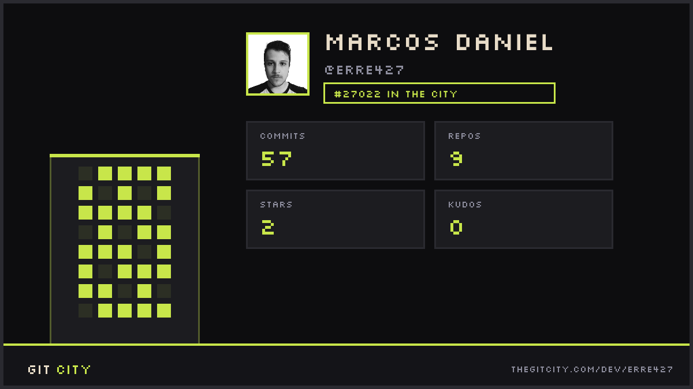

# ¡Hola! 👋 Soy Marcos Daniel (@Erre427)

Soy estudiante de **Ingeniería en Sistemas Computacionales** radicado en Tijuana, México. Me apasiona el desarrollo de software, la creación de herramientas funcionales y la gestión de servidores y bases de datos. 

Actualmente me enfoco en el desarrollo de aplicaciones de escritorio y sistemas integrales, explorando constantemente nuevas tecnologías para el despliegue de servicios y el self-hosting.

### 👨‍💻 Sobre mí
- 🎓 Estudiando Ingeniería en Sistemas Computacionales.
- 💻 Desarrollando **PrintTrack**, un sistema integral en C# y MySQL.
- ⚙️ Experiencia en administración de entornos self-hosted (Ubuntu, Docker, Portainer).
- 🤝 Colaborando en la integración de un sistema de tutorías/asesorías para plataformas institucionales.
- 🎨 Habilidades complementarias en diseño gráfico (Illustrator, Photoshop) para la creación de interfaces y branding.
- 👨‍💻 Actualmente aprendiendo nuevas tecnologias de desarrollo Fullstack como Java

---

### 🛠️ Tecnologías y Herramientas

**Lenguajes y Frameworks:** 

**Bases de Datos y Entornos:** 

**Diseño y Multimedia:** 

---

### 🚀 Proyectos Destacados

* **PrintTrack:** Sistema de gestión desarrollado en C# (Windows Forms) conectado a una base de datos MySQL.
* **Detector de Residuos Industriales:** Sistema tipo compilador desarrollado como proyecto para la materia de Lenguajes y Autómatas I.
* **Sistema de Tutorías:** Proyecto colaborativo para integrar módulos de asesoría académica en una plataforma institucional.
---

### 🏙️ Mi GitCity

  

---
